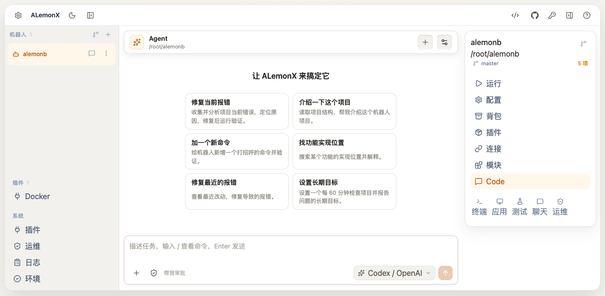

# ALemonX · 机器人的工作台

> 在工作台中创建、运行、管理和扩展 AlemonJS 机器人；也可以让 AI Agent 在你的确认下协助维护项目。

[English](README.en.md) · 中文

[用户手册](docs/user-manual.md) · [一行安装](#一行安装) · [Docker 部署](docs/docker.md) · [命令行](docs/cli.md) · [MCP 文档](docs/mcp.md) · [系统插件开发](docs/plugin-development.md)



## 目录布局

```text
dist/                     前端构建产物（构建时嵌入 alx 二进制，不参与运行期布局）
resources/                运行期资源（构建时嵌入 alx 二进制）
├── templates/            项目模板源（bot/、dev/）
└── packages/             内置工具包（Yarn 嵌入；PM2 等按需用 Yarn 安装）
workspace/                统一工作区（默认 <运行目录>/workspace）
├── templates/            项目模板（首次启动从内嵌模板物化，可编辑）
├── packages/             工具目录（Yarn 物化副本；PM2 首次使用安装到这里，位置固定）
├── bots/                 新建机器人的默认落点
├── plugins/              已安装系统插件（唯一安装目标，优先读取）
└── store/                系统插件持久数据（每个插件使用 store/<插件 ID>/）
```

## 一行安装

macOS、Linux 或 FreeBSD 在终端执行：

```sh
curl -fsSL https://raw.githubusercontent.com/lemonade-lab/alemonx/main/scripts/install.sh | sh
```

Windows 在 PowerShell 执行：

```powershell
irm https://raw.githubusercontent.com/lemonade-lab/alemonx/main/scripts/install.ps1 | iex
```

### 国内用户安装（镜像加速）

`raw.githubusercontent.com` 与 GitHub Releases 在国内可能不稳定。国内用户推荐通过镜像获取安装脚本，并让脚本优先尝试镜像下载源：

macOS、Linux 或 FreeBSD 在终端执行：

```sh
curl -fsSL https://ghfast.top/https://raw.githubusercontent.com/lemonade-lab/alemonx/main/scripts/install.sh | ALX_PREFER_MIRROR=1 sh
```

Windows 在 PowerShell 执行：

```powershell
$env:ALX_PREFER_MIRROR='1'; irm https://ghfast.top/https://raw.githubusercontent.com/lemonade-lab/alemonx/main/scripts/install.ps1 | iex
```

`ghfast.top` 不可用时，把命令里的域名换成 `ghproxy.net` 或 `gh-proxy.com` 即可。安装脚本本身支持 `ALX_DOWNLOAD_BASE` 环境变量指向自建镜像，并会在当前源失败后自动尝试下一个源。

### 手动安装

如需手动下载，可从 [GitHub Releases](https://github.com/lemonade-lab/alemonx/releases) 选择对应系统的压缩包：

| 系统                            | 下载文件                        |
| ------------------------------- | ------------------------------- |
| Windows x64                     | `alx-windows-amd64.zip`         |
| Windows ARM64                   | `alx-windows-arm64.zip`         |
| Windows 32 位                   | `alx-windows-386.zip`           |
| macOS Apple Silicon             | `alx-darwin-arm64.zip`          |
| macOS Intel                     | `alx-darwin-amd64.zip`          |
| Linux x64                       | `alx-linux-amd64.zip`           |
| Linux ARM64                     | `alx-linux-arm64.zip`           |
| Linux ARMv7                     | `alx-linux-armv7.zip`           |
| Linux 32 位 x86                 | `alx-linux-386.zip`             |
| Linux ppc64le / s390x / riscv64 | 对应的 `alx-linux-<架构>.zip`   |
| FreeBSD x64 / ARM64             | 对应的 `alx-freebsd-<架构>.zip` |

国内下载较慢时，可在 GitHub 地址前加镜像前缀，例如 `https://ghfast.top/https://github.com/lemonade-lab/alemonx/releases/latest`。

Windows 直接运行 `alx.exe`。macOS / Linux / FreeBSD：

```bash
chmod +x alx
./alx
```
## Docker 部署

详细的持久化、认证、更新与安全边界见 [Docker 部署文档](docs/docker.md)。

## 操作可控

完整能力范围与权限边界见 [MCP 控制面文档](docs/mcp.md)。

## 文档

- [用户手册](docs/user-manual.md)
- [MCP 控制面](docs/mcp.md)
- [Docker 部署](docs/docker.md)
- [命令行](docs/cli.md)
- [系统插件开发](docs/plugin-development.md)
- [机器人应用页规范](docs/bot-app-page.md)
